图中完整展现了三层结构，点击任意节点可以深入追问。下面补充文字说明每层的核心职责和它们之间的衔接方式。

---

**第一层 — 主线程（asyncio 事件循环）**

这是整个应用的主 loop。`start()` 在这里初始化，并把当前 loop 的引用存入 `_main_loop`。后续所有异步处理（`_prepare_inbound`、两个 Task）都跑在这个 loop 里。`create_task()` 让 `_add_reaction` 和 `_add_message` 并发调度，彼此不阻塞。

**第二层 — 子线程（独立事件循环）**

飞书 WS 客户端的 `start()` 是一个**阻塞调用**，必须放进独立线程，否则会卡死主 loop。子线程自建一个新的 event loop，并把它注入 SDK 模块（替换 `_ws_client_mod.loop`），避免 SDK 内部误用主线程的 uvloop。当 WS 收到消息，`_on_message` 回调被触发，通过 `run_coroutine_threadsafe()` 跨线程安全地把协程提交给主线程 loop 执行。

**第三层 — 线程池（`asyncio.to_thread`）**

飞书的 REST API 调用（`message_reaction.create`、`message.create`）是**同步阻塞**的。如果直接在协程里调用，会把主 loop 卡住。`asyncio.to_thread()` 把它们丢进线程池，主 loop 可以继续响应其他事件，等 API 返回后再 resume。

**三个跨层 API 的分工**

| API | 调用方向 | 用途 |
|---|---|---|
| `run_coroutine_threadsafe()` | 子线程 → 主线程 loop | 跨线程安全提交协程 |
| `asyncio.create_task()` | 在主 loop 内 | 并发启动多个协程，不等待 |
| `asyncio.to_thread()` | 协程 → 线程池 | 防止同步阻塞卡死事件循环 |